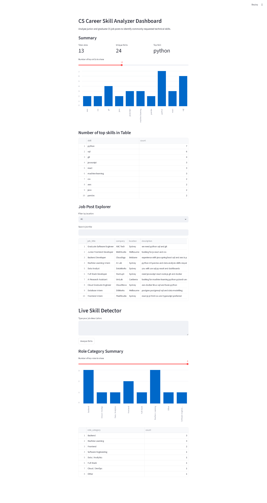
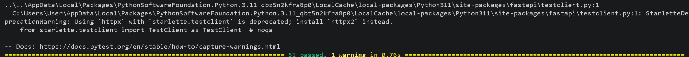

# CS Career Skill Analyzer

A Python project that analyzes junior and graduate CS job posts to identify commonly requested technical skills and job role categories.

This project was built as a personal learning project to improve my Python, backend, data processing, API, dashboard, and testing skills while solving a real problem I faced as a CS student: understanding which skills are actually useful for graduate and junior tech roles.

## Overview

CS Career Skill Analyzer takes job post data from a CSV file, cleans the data, detects technical skills, classifies job roles, and displays the results in an interactive dashboard.

The project includes:

* Data cleaning for messy job post data
* Skill detection using alias-based matching
* Role classification using rule-based logic
* FastAPI backend for live skill detection
* Streamlit dashboard for visualizing results
* Automated tests using pytest

## Problem

As a CS student, it can be hard to know which skills to focus on when preparing for internships, graduate roles, or junior developer jobs.

Job descriptions often mention many tools and technologies, but manually reading every job post takes time. This project helps summarize job post data by showing:

* Which technical skills appear most often
* What types of CS roles appear in the dataset
* Which skills are detected from a pasted job description

## Features

### Data Cleaning

The project reads messy job post data and cleans it by:

* Removing invalid rows
* Removing duplicate job posts
* Cleaning extra spaces and punctuation
* Standardizing job description text

### Skill Detection

The skill detector supports canonical skill names and aliases.

Examples:

* `py` → `python`
* `js` → `javascript`
* `ml` → `machine learning`
* `postgres` → `postgresql`
* `react.js` → `react`
* `fast api` → `fastapi`

It also handles edge cases such as:

* `JavaScript` should not be counted as `Java`
* `node.js` should not accidentally count as `JavaScript`
* `C++` should be detected correctly

### Role Classification

The project classifies jobs into role categories such as:

* Machine Learning
* Data Engineering
* Data / Analytics
* Full Stack
* Frontend
* Backend
* Cloud / DevOps
* Mobile
* Software Engineering
* Other

### FastAPI Backend

The backend provides API routes for checking the app status and detecting skills from job descriptions.

Example endpoint:

```txt
POST /detect-skills
```

Example request:

```json
{
  "description": "We need Python, SQL, React.js and Docker experience."
}
```

Example response:

```json
{
  "description": "We need Python, SQL, React.js and Docker experience.",
  "skills_detected": ["docker", "python", "react", "sql"],
  "total_skills_detected": 4
}
```

### Streamlit Dashboard

The dashboard displays:

* Total jobs analyzed
* Total unique skills detected
* Top skill
* Top skills chart
* Skill count table
* Job post explorer
* Location filter
* Job title search
* Role category summary
* Live skill detector connected to the FastAPI backend

### Automated Tests

The project includes pytest tests for:

* Skill detection
* Data cleaning
* Role classification
* FastAPI routes

All tests pass locally.

## Tech Stack

* Python
* FastAPI
* Streamlit
* Pandas
* pytest
* requests
* CSV
* Regex

## Project Structure

```txt
cs-career-skill-analyzer/
│
├── data/
│   └── dirty_job_posts.csv
│
├── output/
│   ├── cleaned_job_posts.csv
│   ├── top_skills.csv
│   ├── classified_job_posts.csv
│   └── role_counts.csv
│
├── src/
│   ├── api.py
│   ├── dashboard.py
│   ├── data_cleaner.py
│   ├── role_classifier.py
│   ├── skill_config.py
│   └── skill_counter.py
│
├── tests/
│   ├── test_api.py
│   ├── test_data_cleaner.py
│   ├── test_role_classifier.py
│   └── test_skill_counter.py
│
├── README.md
├── requirements.txt
└── .gitignore
```

## How to Run

### 1. Install Dependencies

```bash
python -m pip install -r requirements.txt
```

### 2. Clean Job Post Data

```bash
python -m src.data_cleaner
```

This creates:

```txt
output/cleaned_job_posts.csv
```

### 3. Run Skill Detection

```bash
python -m src.skill_counter
```

This creates:

```txt
output/top_skills.csv
```

### 4. Run Role Classification

```bash
python -m src.role_classifier
```

This creates:

```txt
output/classified_job_posts.csv
output/role_counts.csv
```

### 5. Run FastAPI Backend

```bash
python -m uvicorn src.api:app --reload
```

The API runs at:

```txt
http://127.0.0.1:8000
```

API docs:

```txt
http://127.0.0.1:8000/docs
```

### 6. Run Streamlit Dashboard

Open a second terminal and run:

```bash
python -m streamlit run .\src\dashboard.py
```

The dashboard usually opens at:

```txt
http://localhost:8501
```

### 7. Run Tests

```bash
python -m pytest -v
```

## API Endpoints

### Home

```txt
GET /
```

Returns a basic message that the API is running.

### Health Check

```txt
GET /health
```

Example response:

```json
{
  "status": "ok"
}
```

### Detect Skills

```txt
POST /detect-skills
```

Detects technical skills from a job description.

### Analyze Jobs

```txt
POST /analyze-jobs
```

Analyzes multiple job descriptions and returns skill counts.

## What I Learned

Through this project, I practiced:

* Reading and writing CSV files
* Cleaning messy data
* Removing duplicate records
* Using dictionaries, lists, sets, and functions
* Using regex for safer keyword matching
* Building a FastAPI backend
* Creating API request and response models
* Connecting Streamlit to FastAPI
* Using Pandas for dashboard data
* Creating charts and filters in Streamlit
* Writing automated tests with pytest
* Structuring a Python project for GitHub

## Future Improvements

Possible future improvements:

* Add more real job post data
* Add salary or location comparison
* Add database storage with PostgreSQL
* Deploy the Streamlit dashboard
* Deploy the FastAPI backend
* Add a simple machine learning role classifier
* Add more advanced skill extraction
* Improve dashboard styling
* Add resume skill gap recommendations

## Project Status

Current status: working local version.

The project can clean job post data, detect technical skills, classify roles, show dashboard insights, call the API for live skill detection, and run automated tests.

## Screenshots

### Dashboard Summary


### Tests Passing

